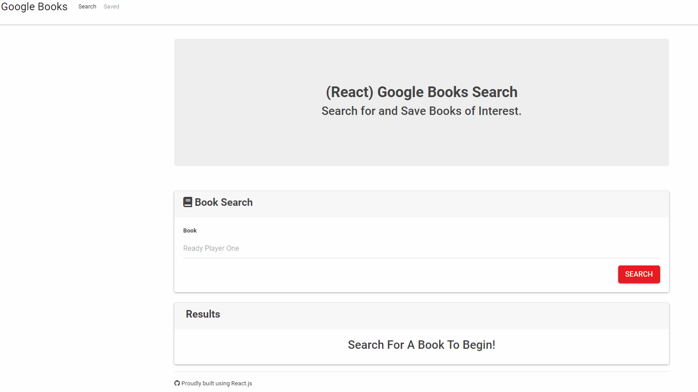

# React_Google_Books_Search

A ```React``` based Google Books Search app where a user can search for books via the Google Books API and render them in the app. User has the option to "View" a book, bringing them to the book on Google Books, "Save" a book, saving it to the Mongo database or "Delete" a book which removes it from the Mongo database. Utilizes React lifecycle methods.

# Technologies Used

- ```React``` components
- Work with helper/util functions,
- Utilize ```React lifecycle methods``` to query and display books based on user searches
- Use ```Node```, ```Express``` and ```MongoDB``` so that users can save books to review or purchase later
- ```Google Books API``` made it all possible

# What This Application Does

* Search - User can search for books via the ```Google Books API``` and render them here. User has the option to "View" a book, bringing them to the book on Google Books, or "Save" a book, saving it to the ```Mongo``` database.

* Saved - Renders all books saved to the ```Mongo``` database. User has an option to "View" the book, bringing them to the book on Google Books, or "Delete" a book, removing it from the ```Mongo``` database.

# Working Application

A working version of the application can be found at: https://quiet-coast-82812.herokuapp.com/saved

### Demonstration of Application

